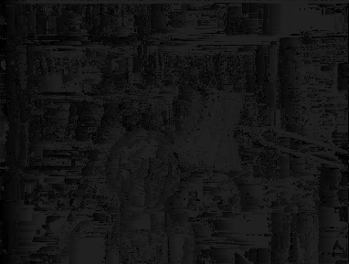
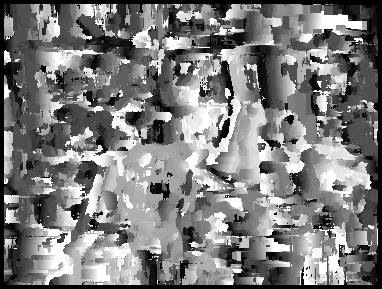
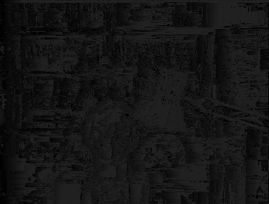
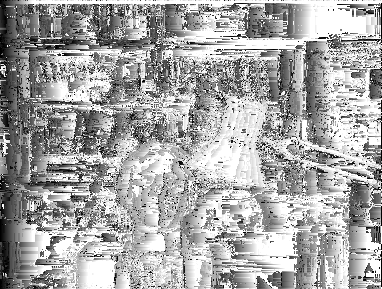
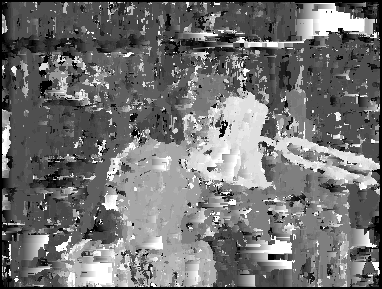
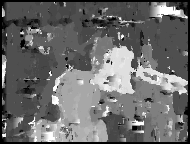
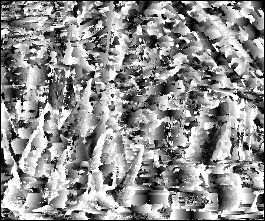
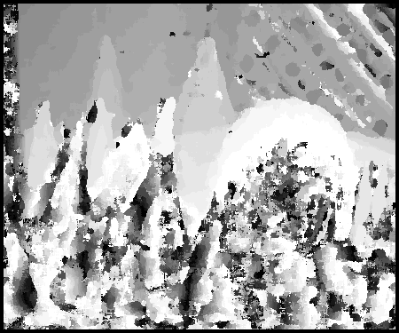
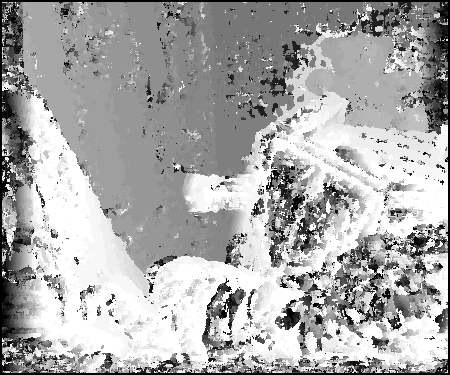
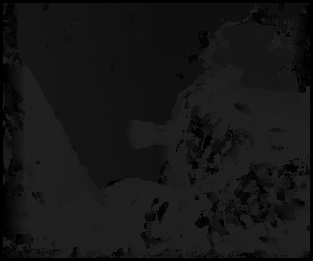

# Stereo Matching


## Table of Contents

## Introduction
This repository contains a Jupyter notebook (`notebook.ipynb`) that demonstrates the concept of stereo matching. Stereo matching is a technique used in computer vision to extract 3D information from 2D images. It involves comparing two or more images of the same scene taken from different viewpoints, and finding "matches" between the images. These matches are points that appear in multiple images, and they can be used to calculate the depth of the scene.

## Stereo Matching

This Python notebook is used for calculating disparity maps from stereo images. It uses two methods for disparity calculation: Sum of Absolute Differences (SAD) and Sum of Squared Differences (SSD). The disparity is calculated for different window sizes.

The `calculate_disparity` function is the core of this script. It takes a pair of stereo images, a window size, and a method (SAD or SSD) as inputs. It calculates the disparity map and a normalized version of it.

The script then iterates over a list of stereo images, window sizes, and methods. For each combination, it calculates the disparity map and saves it, along with the normalized disparity map, to a PNG file in the `results` directory. The filename indicates the image index, window size, and method used.

The `plot_disparity` function is used to plot the disparity map and the normalized disparity map. It takes the disparity map, the normalized disparity map, and the window size as inputs. It then plots the disparity map and the normalized disparity map side by side, and saves the plot to a PNG file in the `results` directory. The filename indicates the image index and window size.

## Installation

This script requires Python 3.6 or higher. It also requires the following Python packages:
```
numpy
PIL
opencv-python
matplotlib
```

## Results

### Image 1

#### SAD

| Window Size | Disparity Map | Normalized Disparity Map | Input Images | 
| ----------- | ------------- | ------------------------ | ------------ |
| 1           |  |  |  |
| 5           |  |  |  |
| 9           |  |  |  |

#### SSD

| Window Size | Disparity Map | Normalized Disparity Map | Input Images |
| ----------- | ------------- | ------------------------ | ------------ |
| 1           |  |  |  |
| 5           |  |  |  |
| 9           |  |  |  |

### Image 2

#### SAD

| Window Size | Disparity Map | Normalized Disparity Map | Input Images |
| ----------- | ------------- | ------------------------ | ------------ |
| 1           |  |  |  |
| 5           |  |  |  |
| 9           |  |  |  |

#### SSD

| Window Size | Disparity Map | Normalized Disparity Map | Input Images |
| ----------- | ------------- | ------------------------ | ------------ |
| 1           |  |  |  |
| 5           |  |  |  |
| 9           |  |  |  |

### Image 3

#### SAD

| Window Size | Disparity Map | Normalized Disparity Map | Input Images |
| ----------- | ------------- | ------------------------ | ------------ |
| 1           |  |  |  |
| 5           |  |  |  |
| 9           |  |  |  |

#### SSD

| Window Size | Disparity Map | Normalized Disparity Map | Input Images |
| ----------- | ------------- | ------------------------ | ------------ |
| 1           |  |  |  |
| 5           |  |  |  |
| 9           |  |  |  |


## Using Dynamic Programming
Dynamic programming is a powerful technique used in stereo matching, a computer vision task that aims to find corresponding points in a pair of stereo images. Stereo matching is commonly used in applications such as depth estimation, 3D reconstruction, and object recognition.

In stereo matching, dynamic programming is used to find the optimal disparity map, which represents the pixel-wise differences between the left and right images. The disparity map provides valuable information about the depth and structure of the scene.

The process begins by calculating the cost matrix, which measures the dissimilarity between pixels in the left and right images. The cost matrix is computed using a cost function that quantifies the similarity or dissimilarity between corresponding pixels.

Dynamic programming is then applied to find the optimal alignment between the left and right images. The cost matrix is used to calculate the disparity map by finding the path with the minimum cost from the top-left corner to the bottom-right corner of the matrix. This path represents the optimal alignment of pixels between the two images.

By using dynamic programming, stereo matching algorithms can efficiently find the disparity map by avoiding redundant computations. This technique significantly improves the accuracy and speed of stereo matching compared to brute-force methods.

Overall, dynamic programming plays a crucial role in stereo matching by providing an efficient and effective solution for finding corresponding points in stereo images. It enables accurate depth estimation and 3D reconstruction, making it a fundamental technique in computer vision applications.

### Results

| Input Image | Disparity Map | Normalized Disparity Map |
| ----------- | ------------- | ------------------------ |
|  |  |  |
|  |  |  |
|  |  |  |


## Contributers

1. [Yousef Kotp]()
2. [Mohammed Farid]()
3. [Adham Mohammed]()
